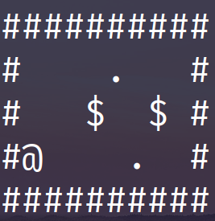
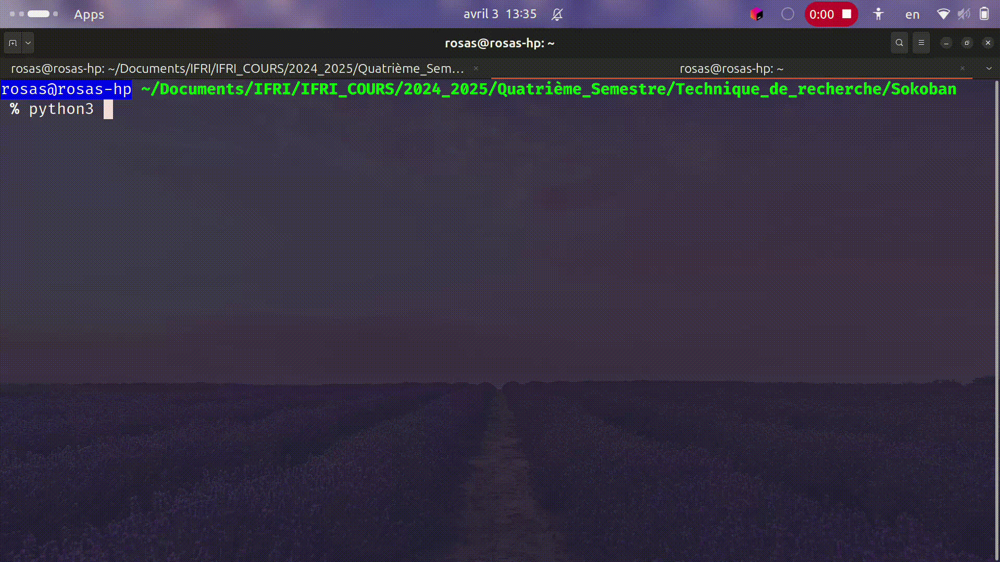

# Projet Sokoban

Ce projet est développé dans le cadre du cours de Techniques de Recherche.

## Description

Sokoban est un jeu de puzzle où le joueur doit pousser des boîtes vers des emplacements cibles dans un labyrinthe. L'objectif est de résoudre chaque niveau en plaçant toutes les boîtes sur les cibles tout en respectant les règles suivantes :
- Les boîtes ne peuvent être poussées qu'une à la fois.
- Le joueur ne peut pas tirer les boîtes, seulement les pousser.
- Le joueur ne peut pas traverser les murs ou les boîtes.



- @ représente l'agent
- "#" représente les murs
- $ représente les boîtes
- . représente les positions cibles des boîtes

## Objectifs du Projet

- Implémenter une version fonctionnelle du jeu Sokoban.
- Explorer et appliquer des techniques de recherche pour résoudre automatiquement les niveaux du jeu.
- Étudier et comparer différentes approches algorithmiques pour résoudre les puzzles.

## Structure du Projet

- **Code Source**: Contient l'implémentation du jeu et des algorithmes de résolution.
- **Documentation**: Fournit des explications sur les algorithmes utilisés et les choix de conception.
- **Tests**: Inclut des niveaux de test et des scripts pour valider les solutions.

## Prérequis

- Python 3.x
- Bibliothèques requises (à installer via `requirements.txt`)

## Installation

1. Cloner le dépôt du projet :
    ```bash
    git clone https://github.com/rosasbehoundja/sokoban-game.git
    cd sokoban-game
    ```
2. Installer les dépendances :
    ```bash
    pip install -r requirements.txt
    ```

## Utilisation

1. Pour exécuter les algorithmes de résolution automatique :
    ```bash
    python solve.py --level <niveau_jeu> --method <choix_algorithme>
    ```



## Auteurs

Ce projet a été créé par des étudiants de l'IFRI dans le cadre du cours de Techniques de Recherche.

 - [Emmanuella GBODO](mailto:gbodoemmanuella40@gmail.com)
 - [Rosas BEHOUNDJA](mailto:perrierosas@gmail.com)